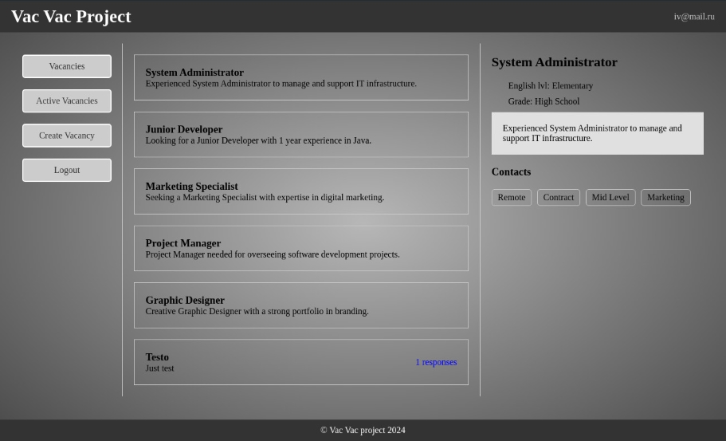
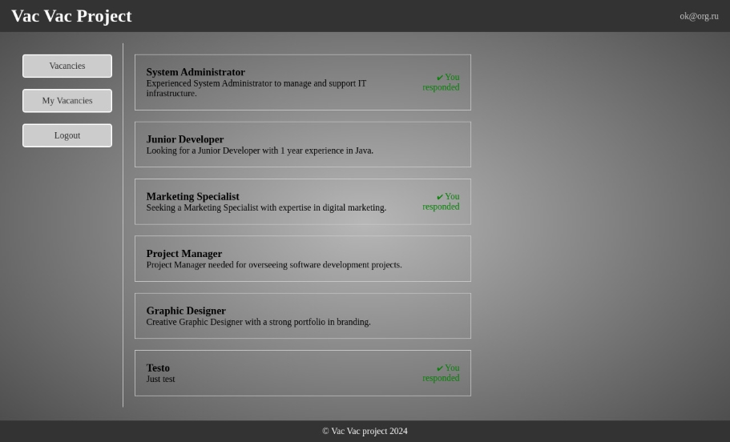
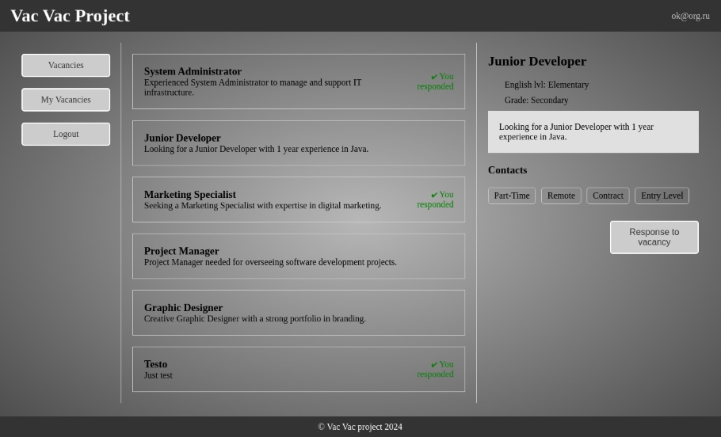
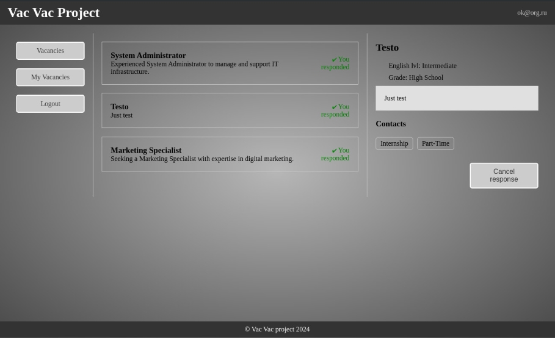
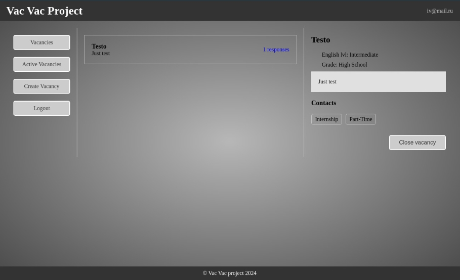
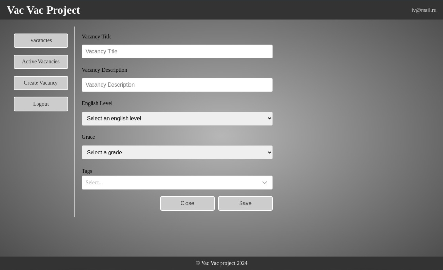
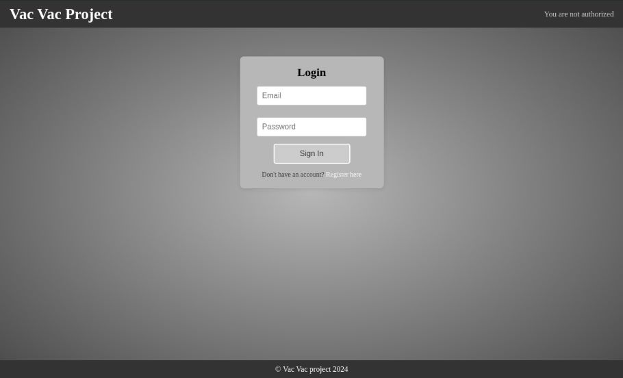
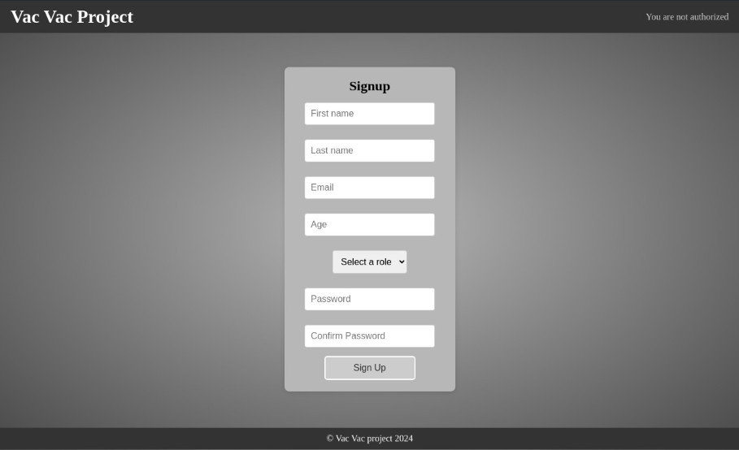

# Vac Vac

Vac Vac is a comprehensive job application platform designed for both job seekers and employers. The
application ensures secure access for authenticated users only, maintaining their sessions even
after page reloads. The platform consists of six main pages, each catering to the different needs of
job seekers and employers.

## Features

### Common Pages

- **Vacancies Page**: Accessible by both job seekers and employers, displaying a list of available
  job postings.

  Employer side:
  

  Job seeker side:
  
- **Vacancy Details Page**: Accessible by both job seekers and employers, displaying detailed
  information about a specific job posting.
  

### Job Seeker Pages

- **My Vacancies Page**: Lists the job postings the user has applied to.
  

### Employer Pages

- **Active Vacancies Page**: Lists the active job postings created by the employer.
  
- **Active Vacancy Details Page**: Displays detailed information about a specific active job posting
  created by the employer, with options to close the vacancy.
- **Create Vacancy Page**: Allows employers to create new job postings.
  

### Authentication Pages

- **Login Page**: For user authentication.
  
- **Common Registration Page**: For job seekers and companies to register.
  

## User Permissions

- **Employers**: Can view the number of applicants for their job postings, close vacancies, and
  create new job postings.
  They cannot access job seeker-specific pages.
- **Job Seekers**: Can view and apply to job postings, see which jobs they have applied to, and
  cancel applications. They cannot access employer-specific pages and will be redirected to the
  Vacancies Page if attempting to access restricted pages.

## Backend Endpoints

### User Routes

- **POST /users**: Register a new user.
- **POST /auth**: Authenticate a user.
- **GET /roles**: Retrieve a list of roles.
- **GET /users/{id}**: Get user details by ID.
- **PUT /users/{id}**: Update user details by ID.
- **DELETE /users/{id}**: Delete a user by ID.

### Vacancy Routes

- **POST /vacancies**: Create a new vacancy.
- **GET /vacancies/{id}**: Retrieve details of a specific vacancy.
- **GET /vacancies**: Retrieve a list of all active vacancies.
- **GET /vacancies/employer**: Retrieve all vacancies created by the current employer.
- **GET /vacancies/employee**: Retrieve vacancies to which the current job seeker has applied.
- **PUT /vacancies/{id}/change-visible**: Update the visibility of a vacancy.
- **GET /vacancies/tags**: Retrieve a list of vacancy tags.
- **GET /vacancies/education-levels**: Retrieve a list of education levels.
- **GET /vacancies/english-levels**: Retrieve a list of English language levels.
- **POST /vacancies/{id}/response**: Apply to a vacancy.
- **DELETE /vacancies/{id}/cancel-response**: Cancel an application to a vacancy.
- **POST /vacancies/response-statuses**: Retrieve response statuses for vacancies.
- **POST /vacancies/response-counts**: Retrieve the number of responses for vacancies.

## Technology Stack

- **Frontend**: TS (React, Redux toolkit, Styled-components).
- **Backend**: Kotlin (Ktor, exposed, sqlite).

## Setup Instructions

### Backend

1. Navigate to the backend directory.
2. Build the project and install dependencies: `./gradlew build`.
3. Start the backend server: `./gradlew run`.

### Frontend

1. Open a new terminal and navigate to the React application directory.
2. Install dependencies: `yarn install`.
3. Start the frontend application: `yarn start`.

## Repository Structure

- **backend/**: Contains backend server code.
- **frontend/**: Contains React application code.

Vac Vac is designed to streamline the job application process, providing a user-friendly interface
for both job seekers and employers to interact seamlessly.
